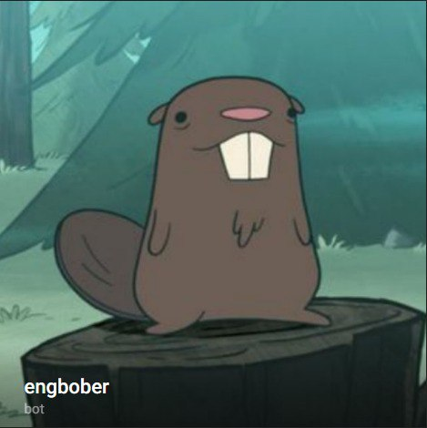
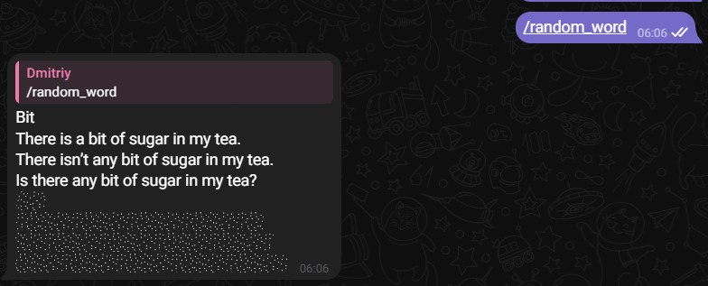
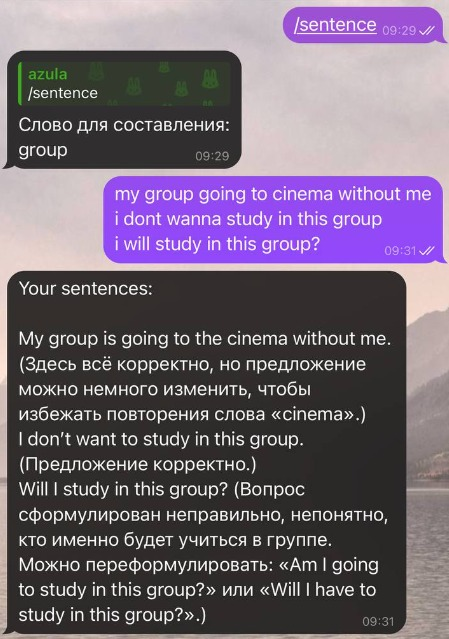

<h1>О проекте</h1>

### Небольшой Telegram бот, помогающий изучать английский язык.

### Бот основан на YandexGPT API и хостится через Apps в TimeWeb Cloud.

## **Функции бота:**

* ###  Генерация слова и предложений с его использованием(повествовательное, вопросительное, отрицательное) с переводом в скрытом тексте. 

 

* ### Выдача слова и проверка предложения с этим словом на корректность. 

